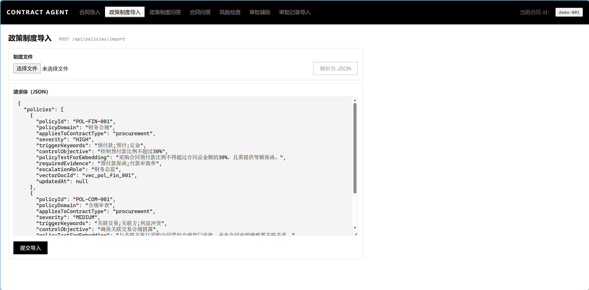
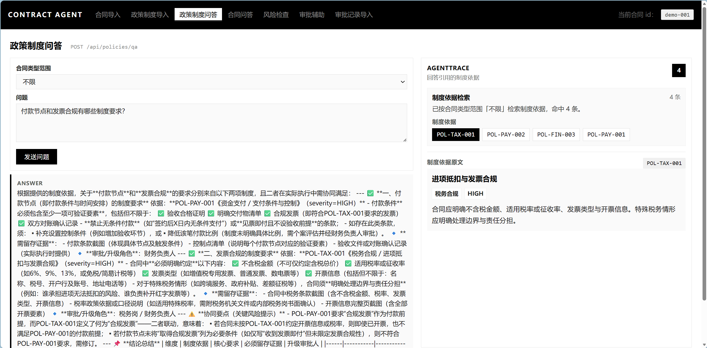
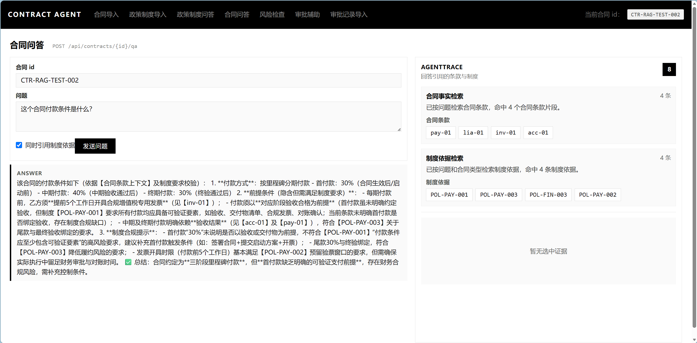
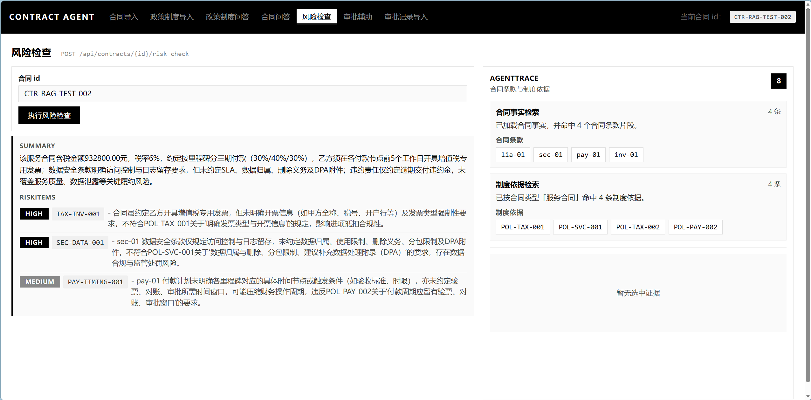
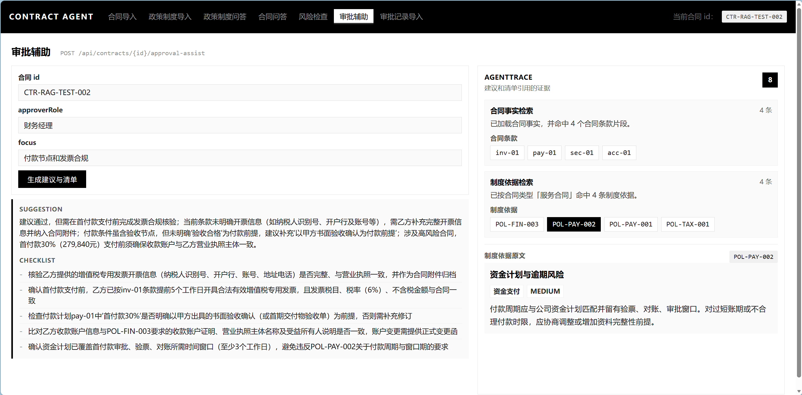

# 财务合同审批 Agent

基于 **Spring Boot 3 + Spring AI + PostgreSQL/pgvector + MyBatis + Vue3** 的财务合同审批 Agent 项目。

线上体验：[https://contract.zhigu.site/contracts](https://contract.zhigu.site/contracts)

项目面向企业财务、法务和业务审批场景，围绕合同导入、合同问答、风险检查、审批辅助、审批记录导入和制度知识库导入构建一个可演示的端到端。核心目标不是做通用聊天机器人，而是让大模型在明确的合同事实、制度依据和审批历史范围内生成可追溯的问答、风险项和审批建议。

## 项目亮点
- **多通道证据检索**：合同问答支持合同条款和制度知识双通道检索，风险检查和审批辅助固定使用双通道，确保证据的全面性和准确性。
- **检索重排序**：优化合同审核 RAG 检索链路，引入 Top30 量级候选召回、qwen3-rerank 精排与 MMR 多样性截断；构建离线评测集量化检索效果，使 Recall@4 提升约 12%，Precision@4 提升约 15%，MRR@4 提升至 0.98+。详见 [`docs/RAG_RETRIEVAL_OPTIMIZATION.md`](docs/RAG_RETRIEVAL_OPTIMIZATION.md)。
- **轻量多 Agent 编排**：将审批链路拆分为合同事实 Agent、制度依据 Agent、风险审查 Agent、审批建议 Agent，并通过 `AgentTrace` 记录执行过程，便于前端展示和问题排查。
- **结构化风险输出**：风险检查要求模型输出 JSON，包含 `summary`、`riskItems`、关联条款、制度依据、补充材料和升级角色等字段，后端使用 Jackson 解析并提供异常兜底。
- **向量写入工程化处理**：封装 `VectorBatchWriter`，支持分批 embedding、`delete + add` 幂等覆盖和失败重试语义，解决 embedding 服务单批输入限制与重复导入冲突问题。
- **业务数据与向量索引分离**：合同、条款、审批记录、制度知识库由 PostgreSQL/MyBatis 作为权威存储，pgvector 作为派生检索索引，职责边界清晰。
- **前后端闭环演示**：Vue3 前端覆盖合同导入、合同问答、风险检查、审批辅助、审批记录导入和制度知识库导入页面。

## 技术栈

| 模块 | 技术 |
| --- | --- |
| 后端 | Java 21、Spring Boot 3.5、Spring AI、Spring Web、Validation |
| AI/RAG | OpenAI-compatible Chat/Embedding API、pgvector、Spring AI VectorStore |
| 数据访问 | PostgreSQL、MyBatis、JDBC |
| 前端 | Vue3、Vite、TypeScript、Pinia、Vue Router、Axios、Element Plus |
| 测试 | JUnit 5、Spring Boot Test、Testcontainers |

## 简化架构

```text
Vue3 页面
  |
  v
Controller
  |
  v
Application Service
  |
  +--> ContractRepository / PolicyKnowledgeRepository
  |      |
  |      v
  |   PostgreSQL 业务表
  |
  +--> AiContractAssistant
         |
         +--> Contract Fact Agent
         +--> Policy Evidence Agent
         +--> Risk Review Agent / Approval Advice Agent
         |
         +--> PgVectorRagRetriever
         +--> PgVectorPolicyRagRetriever
                |
                v
             pgvector
```

## 界面截图

以下截图覆盖制度知识库导入、制度问答、合同问答、风险检查和审批辅助等核心演示链路.

### 制度知识库导入



### 政策制度问答



### 合同问答



### 风险检查



### 审批辅助



## 核心能力

### RAG 检索链路优化

系统没有直接使用向量检索 TopK 作为最终上下文，而是采用“扩大召回 + 重排序 + MMR 截断”的两阶段检索策略。合同条款通道先按 `contractId` 限定当前合同，制度知识通道先按 `docType=policy` 和合同类型收敛候选范围；随后 `RagResultReranker` 融合 pgvector 相似度、本地业务规则和 qwen3-rerank 分数，并通过 MMR 避免 TopK 被同类条款或同一制度领域占满。

- 关键代码：`PgVectorRagRetriever`、`PgVectorPolicyRagRetriever`、`RagResultReranker`
- 评测数据：`data/evaluation/rag-eval-cases.jsonl`、`data/evaluation/rag-qrels.jsonl`
- 详细说明：[`docs/RAG_RETRIEVAL_OPTIMIZATION.md`](docs/RAG_RETRIEVAL_OPTIMIZATION.md)

### 合同导入

通过接口导入合同主数据和条款分块，后端写入业务表，并将条款分块同步写入向量库。

- API：`POST /api/contracts/import`
- 关键代码：`ContractApplicationService#importContract`、`ContractVectorIngestionService`

### 合同问答

针对指定合同进行问答。系统先校验合同是否存在，默认只从合同条款通道召回上下文；当请求体 `includePolicyEvidence=true` 时，额外按合同类型召回制度依据。最终由大模型生成回答，并返回命中的条款 ID 和可选制度 ID。

- API：`POST /api/contracts/{id}/qa`
- 关键代码：`AiContractAssistant#answerQuestion`、`PgVectorRagRetriever`、`PgVectorPolicyRagRetriever`

### 风险检查

基于合同摘要、合同条款、制度依据和历史审批摘要生成结构化风险项。模型输出被约束为 JSON，后端解析为领域对象返回给前端。

- API：`POST /api/contracts/{id}/risk-check`
- 输出字段：`summary`、`riskItems`、`agentTrace`
- 关键代码：`AiContractAssistant#riskCheck`、`ContractPrompts#riskCheckSystem`

### 审批辅助

根据当前审批角色和关注点，结合合同事实、制度依据和历史审批记录生成审批建议与 checklist。

- API：`POST /api/contracts/{id}/approval-assist`
- 输出字段：`suggestion`、`checklist`、`retrievedChunkIds`、`retrievedPolicyIds`、`agentTrace`
- 关键代码：`AiContractAssistant#approvalAssist`

### 政策制度问答

针对制度知识库直接提问，可选按合同类型收敛适用制度范围，不读取具体合同条款。

- API：`POST /api/policies/qa`
- 关键代码：`AiContractAssistant#answerPolicyQuestion`、`PgVectorPolicyRagRetriever`

### 制度知识库导入

导入跨合同共享的制度知识条目，并写入向量库。制度条目包含适用合同类型、严重程度、触发关键词、补充材料要求和升级角色等信息。

- API：`POST /api/policies/import`
- 关键代码：`PolicyKnowledgeApplicationService`、`PolicyVectorIngestionService`


## 数据模型

主要业务表定义见 `src/main/resources/schema.sql`。

- `contracts`：合同主数据
- `clause_chunks`：合同条款分块
- `approval_records`：历史审批记录
- `policy_knowledge`：制度知识库
- `vector_store`：Spring AI pgvector 自动管理的向量索引表

## 快速启动

### 1. 启动 PostgreSQL + pgvector

可以使用本地 PostgreSQL，也可以使用 Docker：

```bash
docker run --name contract-agent-pg \
  -p 5432:5432 \
  -e POSTGRES_DB=contract_agent \
  -e POSTGRES_USER=postgres \
  -e POSTGRES_PASSWORD=123456 \
  pgvector/pgvector:pg16
```

### 2. 配置模型环境变量

项目使用 OpenAI 兼容接口，默认配置可对接 DashScope compatible mode，也可以替换为其他兼容服务。

```bash
export OPENAI_BASE_URL=https://dashscope.aliyuncs.com/compatible-mode
export OPENAI_API_KEY=your_api_key
export OPENAI_CHAT_MODEL=qwen-plus
export OPENAI_EMBEDDING_MODEL=text-embedding-v3
export OPENAI_EMBEDDING_DIMENSIONS=1024
```

Windows PowerShell 示例：

```powershell
$env:OPENAI_BASE_URL="https://dashscope.aliyuncs.com/compatible-mode"
$env:OPENAI_API_KEY="your_api_key"
$env:OPENAI_CHAT_MODEL="qwen-plus"
$env:OPENAI_EMBEDDING_MODEL="text-embedding-v3"
$env:OPENAI_EMBEDDING_DIMENSIONS="1024"
```

### 3. 启动后端

```bash
./mvnw spring-boot:run
```

Windows PowerShell：

```powershell
.\mvnw.cmd spring-boot:run
```

默认端口：`8088`。

### 4. 启动前端

```bash
cd web
pnpm install
pnpm dev
```

前端默认访问：`http://localhost:5173`。

Vite 已配置 `/api` 代理到 `http://localhost:8088`，本地联调无需额外处理 CORS。

## 主要接口

| 功能 | 方法 | 路径 |
| --- | --- | --- |
| 导入合同 | POST | `/api/contracts/import` |
| 合同问答 | POST | `/api/contracts/{id}/qa` |
| 政策制度问答 | POST | `/api/policies/qa` |
| 风险检查 | POST | `/api/contracts/{id}/risk-check` |
| 审批辅助 | POST | `/api/contracts/{id}/approval-assist` |
| 导入审批记录 | POST | `/api/contracts/{id}/approval-records/import` |
| 导入制度知识库 | POST | `/api/policies/import` |

更完整的接口说明见 `docs/API_REFERENCE.md`。

## 前端页面

| 页面 | 路径 | 说明 |
| --- | --- | --- |
| 合同导入 | `/contracts/import` | 导入合同主数据和条款分块 |
| 合同问答 | `/contracts/:id/qa` | 对指定合同提问 |
| 政策制度问答 | `/policies/qa` | 对制度知识库提问 |
| 风险检查 | `/contracts/:id/risk` | 生成结构化风险项 |
| 审批辅助 | `/contracts/:id/approval-assist` | 生成审批建议和 checklist |
| 审批记录导入 | `/contracts/:id/approval-records` | 导入历史审批记录 |
| 制度知识库导入 | `/policies/import` | 导入公司制度条目 |

## 项目结构

```text
src/main/java/com/yy/agent/contract
├── ai
│   ├── agent       # 轻量 Agent 抽象、编排器和 Trace
│   ├── prompt      # Prompt 模板与结构化输出约束
│   ├── rag         # 合同/制度双通道 RAG 检索与向量写入
│   └── tool        # 面向 AI 编排层的合同事实读取工具
├── api/dto         # 请求与响应 DTO
├── controller      # REST API
├── domain          # 领域对象与枚举
├── mapper          # MyBatis Mapper
├── repository      # 仓储抽象与 MyBatis 实现
└── service         # 应用服务层

web/src
├── api             # 前端接口封装
├── pages           # 业务页面
├── router          # 路由配置
├── stores          # Pinia 状态
└── types           # TypeScript 类型
```

## 测试

```bash
./mvnw test
```

Windows PowerShell：

```powershell
.\mvnw.cmd test
```
